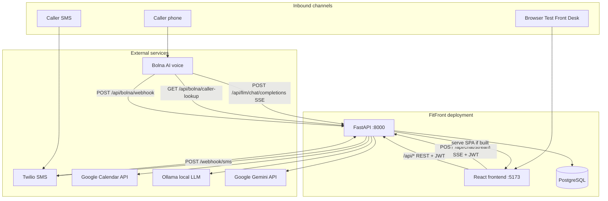
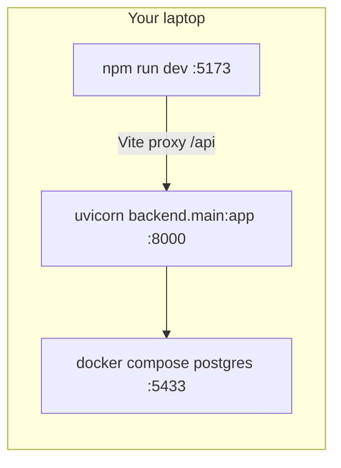
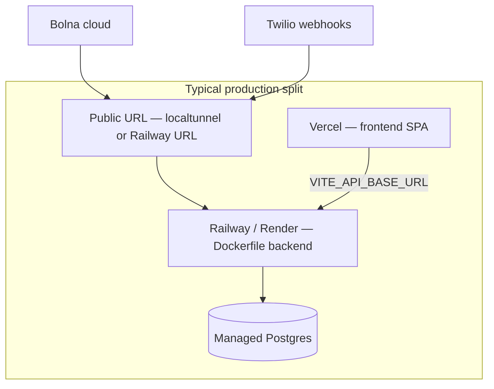

# 01 — High-Level Design

## System architecture

Think of FitFront as three concentric rings:

1. **Channels** — how humans reach the agent (phone, SMS, browser chat)
2. **Agent core** — FastAPI + LLM tool loop + Postgres
3. **Staff dashboard** — React CRM for studio owners and platform admins



**Data-flow direction:**

- **Inbound voice:** Caller → PSTN → Bolna STT/TTS → FitFront `/api/llm` (tool loop) → Bolna speaks response.
- **Inbound SMS:** Caller → Twilio → `/webhook/sms` → keyword fast-path or `llm_service.process_message` → Twilio TwiML reply.
- **Dashboard:** Browser → Vite dev proxy or static `frontend/dist` → JWT-authenticated REST.
- **Outbound side effects:** Tool handlers write Postgres, optionally send SMS (`sms_service`) and create GCal events (`google_calendar`).

Router registration is centralized in `backend/main.py:288–305`.

---

## Deployment diagram

### Local demo (default `.env.example`)



| Component | Where it runs | Source |
|-----------|---------------|--------|
| Postgres 15 | Docker container `scheduler_ai_db`, host port **5433** | `docker-compose.yml:1–20` |
| Backend | Host process (`./start.sh` or manual uvicorn) | `start.sh:92–134`, `Dockerfile:1–21` |
| Frontend | Host Vite dev server | `frontend/vite.config.js:6–12` |
| LLM | Ollama on localhost (default `LLM_PROVIDER=ollama`) | `backend/config.py`, `.env.example` |
| Tunnel | **Skipped** when `LOCAL_CHAT_MODE=true` | `start.sh:24–35` |

No app containers in compose — only the database.

### Full-stack / production mode

Documented in `docs/FULL_STACK_SETUP.md`. Summary from code + docs:



| Component | Where | Config |
|-----------|-------|--------|
| Backend API | Railway (`railway.json` → Dockerfile, health `/health`) | `railway.json:1–13` |
| Frontend | Separate static deploy (`frontend/vercel.json`) | `backend/main.py:320–331` serves `frontend/dist` if present |
| Postgres | Docker locally or managed URL in prod | `DATABASE_URL` |
| Public webhooks | `SERVER_BASE_URL` must be reachable | `start.sh:36–90` uses localtunnel when `LOCAL_CHAT_MODE=false` |
| Voice LLM | **Gemini required** for Bolna (Ollama not reachable from cloud) | `docs/FULL_STACK_SETUP.md` |

**Inference:** Railway runs a single-worker uvicorn (`Dockerfile:21` — `--workers 1`), so in-memory LLM sessions are not shared across instances. Horizontal scaling would need external session storage (not implemented today).

---

## Multi-tenancy model

FitFront uses **shared database, shared schema, row-level isolation** — not separate schemas or deployments per studio.

### How isolation is enforced (concrete mechanisms)

There is **no tenant middleware**. Isolation happens in three layers:

#### 1. Authentication → tenant identity

```python
# backend/services/auth_service.py:99–143
async def get_current_user(
    credentials: Optional[HTTPAuthorizationCredentials] = Depends(bearer_scheme),
) -> Tenant:
    payload = decode_token(credentials.credentials)
    tenant_uuid = uuid.UUID(payload.get("sub", ""))
    # ... load Tenant row, block SUSPENDED/DEACTIVATED ...
    return tenant
```

JWT `sub` = tenant UUID. Spring analogue: a custom `OncePerRequestFilter` that loads `Tenant` from token claims — except FastAPI uses `Depends(get_current_user)` per route.

#### 2. Query scoping in route handlers

Patterns seen across routes:

| Pattern | Example tables | Mechanism |
|---------|----------------|-----------|
| Direct `tenant_id` filter | `callers`, `calls`, `trainers`, `support_tickets` | `WHERE tenant_id = current_user.id` |
| Join via `callers` | `appointments`, `waitlist_entries`, `sms_messages` | `Appointment.tenant_id` is a **derived** `@property` via caller (`backend/models/appointment.py:4–6`) |
| Admin override | Tenant list, support admin | `require_admin` + optional `tenant_id` query param |
| Ownership check | Single-resource GET/PUT | 403 if `resource.tenant_id != current_user.id` unless admin |

Example from appointment cancel:

```python
# backend/routes/appointments.py:194–195
if not current_user.is_admin and apt.tenant_id != current_user.id:
    raise HTTPException(status_code=403, detail="Access denied.")
```

#### 3. `TenantContext` threaded into services

Once resolved, config is frozen in a dataclass and passed to calendar/SMS/LLM tools (`backend/services/tenant_service.py:72–147`). Tools never read another tenant's Twilio keys or knowledge base.

### Unauthenticated / integration paths (important caveat)

| Entry point | Tenant resolution | Code |
|-------------|-------------------|------|
| Dashboard API | JWT → `current_user.id` | `auth_service.get_current_user` |
| Local chat | JWT → `resolve_by_id(current_user.id)` | `backend/routes/chat.py:110` |
| Inbound SMS | Match Twilio `To` → `Tenant.twilio_phone_number` | `sms_inbound_service.py:75–113` |
| LLM proxy (voice) | **`resolve_default_tenant()` — first ACTIVE tenant** | `llm_proxy.py:102` |
| Bolna webhook | Same default tenant | `bolna.py:275–276` |

**This is a real architectural limitation:** with multiple ACTIVE tenants, voice/Bolna traffic is not routed per studio phone number today — it falls back to the first active tenant. SMS *is* routed by phone number. **Inference:** The codebase is optimized for demo/single-tenant production until Bolna assistant mapping per tenant is built.

---

## Who talks to whom (narrative)

1. **Studio owner** opens the React app, logs in (`POST /api/auth/login`), gets a JWT. Every CRM action hits `/api/*` with `Authorization: Bearer …`.

2. **Prospective member** calls the studio number. Bolna answers, streams audio to its LLM config pointing at `{SERVER_BASE_URL}/api/llm/chat/completions`. FitFront replaces the system prompt, runs tools (slots, book, KB lookup), streams tokens back. When the call ends, Bolna POSTs to `/api/bolna/webhook`; FitFront stores a `calls` row.

3. **Member texts “CANCEL”** to the studio Twilio number. Twilio POSTs form data to `/webhook/sms`. FitFront resolves tenant by `To` number, cancels the appointment, sends confirmation SMS, and calls `check_waitlist_for_opening` to notify the next waitlisted person.

4. **Platform admin** uses the same JWT mechanism with `is_admin=true` to list pending tenants and `POST /api/tenants/{id}/approve`.

5. **Background reminders** — `run_reminder_loop` starts on app lifespan (`backend/main.py:210`) and sends scheduled SMS via Twilio when not in demo mode.

---

## Spring Boot comparison (multi-tenancy)

| FitFront | Spring equivalent |
|----------|-------------------|
| `Tenant` ORM row + JWT `sub` | UserDetails with `tenantId` claim |
| `Depends(get_current_user)` | `@AuthenticationPrincipal` + security filter |
| Manual `WHERE tenant_id = ?` in queries | Hibernate `@Filter` / custom `TenantAwareRepository` (not auto here) |
| `TenantContext` dataclass | Immutable DTO passed into `@Service` methods |

FitFront chooses explicit query filters over magic ORM filters — easier to grep, easier to miss a filter on a new route.

Next: [02_LLD.md — Low-Level Design](./02_LLD.md)
