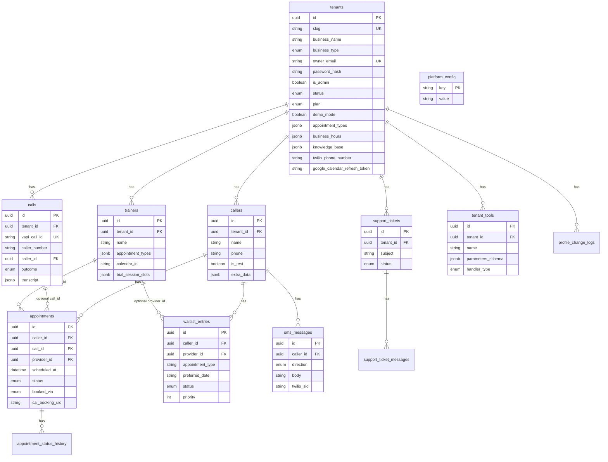
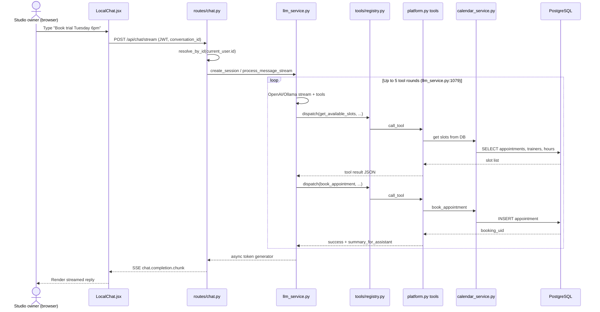
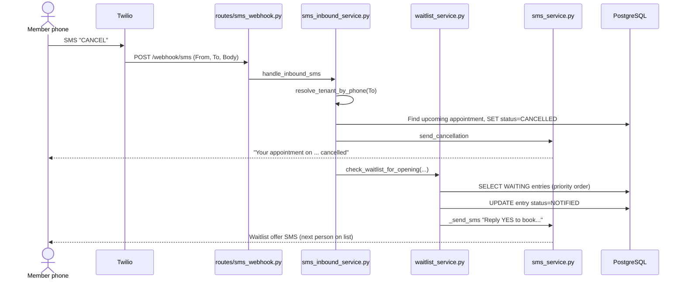
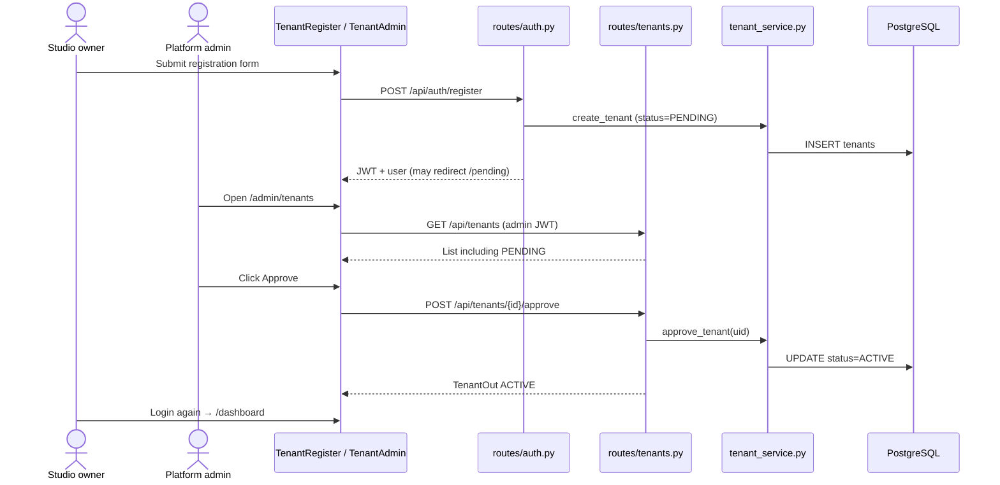

# 02 — Low-Level Design

## Entity-relationship diagram

Derived from SQLAlchemy models in `backend/models/`. Table names match `__tablename__`.

**Note:** `appointments` has no stored `tenant_id` column — tenant scope is via `caller_id → callers.tenant_id` (`backend/models/appointment.py:4–6`).

**Legacy naming:** `Call.vapi_call_id` stores Bolna `execution_id` too (`backend/routes/bolna.py:307`). `Trainer` is aliased as `Provider` in imports.

---

## API surface map

All routes registered in `backend/main.py:288–305`. Methods and paths taken from route decorators.

### App-level

| Method | Path | Purpose |
|--------|------|---------|
| GET | `/health` | Health check + `demo_mode` flag (`main.py:308–315`) |
| GET | `/{full_path:path}` | Serve React SPA when `frontend/dist` exists (`main.py:325–331`) |

### `/api/auth` — `backend/routes/auth.py`

| Method | Path | Purpose |
|--------|------|---------|
| POST | `/api/auth/login` | Email/password → JWT |
| POST | `/api/auth/register` | Self-register studio (creates tenant) |
| GET | `/api/auth/me` | Current user profile |
| PATCH | `/api/auth/profile` | Update owner profile |
| POST | `/api/auth/change-password` | Change password |
| GET | `/api/auth/profile-changes` | Audit log of profile edits |

### `/api/tenants` — `backend/routes/tenants.py`

| Method | Path | Purpose |
|--------|------|---------|
| POST | `/api/tenants` | Onboard new studio (status PENDING) |
| GET | `/api/tenants` | List tenants (admin) |
| GET | `/api/tenants/usage` | Current tenant usage meters |
| GET | `/api/tenants/plans` | Plan tier definitions |
| GET | `/api/tenants/{tenant_id}` | Tenant detail |
| PUT | `/api/tenants/{tenant_id}` | Update tenant config |
| POST | `/api/tenants/{tenant_id}/approve` | PENDING → ACTIVE (admin) |
| POST | `/api/tenants/{tenant_id}/suspend` | ACTIVE → SUSPENDED |
| POST | `/api/tenants/{tenant_id}/reactivate` | Restore ACTIVE |
| DELETE | `/api/tenants/{tenant_id}` | Soft deactivate |
| DELETE | `/api/tenants/{tenant_id}/purge` | Hard delete all tenant data (admin) |

### `/api/chat` — `backend/routes/chat.py`

| Method | Path | Purpose |
|--------|------|---------|
| GET | `/api/chat/enabled` | Always `{enabled: true}` |
| POST | `/api/chat/reset` | Clear LLM session for conversation |
| POST | `/api/chat/stream` | SSE chat through tool loop (JWT) |

### `/api/llm` — `backend/routes/llm_proxy.py`

| Method | Path | Purpose |
|--------|------|---------|
| POST | `/api/llm/chat/completions` | OpenAI-compatible SSE for Bolna/voice |

### `/api/calls` — `backend/routes/calls.py`

| Method | Path | Purpose |
|--------|------|---------|
| GET | `/api/calls` | Paginated call log |
| GET | `/api/calls/export` | CSV export |
| GET | `/api/calls/{call_id}` | Call detail + transcript |

### `/api/appointments` — `backend/routes/appointments.py`

| Method | Path | Purpose |
|--------|------|---------|
| GET | `/api/appointments` | List sessions |
| POST | `/api/appointments/{id}/cancel` | Dashboard cancel + SMS + optional GCal |
| PATCH | `/api/appointments/{id}` | Reschedule / status / notes |
| GET | `/api/appointments/{id}/history` | Status audit trail |
| POST | `/api/appointments/sync-gcal` | Bidirectional Google Calendar sync |

### `/api/callers` — `backend/routes/callers.py`

| Method | Path | Purpose |
|--------|------|---------|
| GET | `/api/callers` | Member list |
| GET | `/api/callers/{id}` | Member profile + history |
| PUT | `/api/callers/{id}` | Update member |
| POST | `/api/callers/bulk-delete` | Bulk delete |
| DELETE | `/api/callers/test-data` | Clear test members |
| DELETE | `/api/callers/{id}` | Delete one member |

### `/api/trainers` and `/api/providers` — `backend/routes/providers.py`

Same router mounted twice (`main.py:296–297`).

| Method | Path | Purpose |
|--------|------|---------|
| GET | `/api/trainers` | List trainers |
| POST | `/api/trainers` | Create trainer |
| PUT | `/api/trainers/{provider_id}` | Update trainer |
| DELETE | `/api/trainers/{provider_id}` | Delete trainer |

### `/api/waitlist` — `backend/routes/waitlist.py`

| Method | Path | Purpose |
|--------|------|---------|
| GET | `/api/waitlist` | List waitlist entries |
| DELETE | `/api/waitlist/{entry_id}` | Remove entry |
| POST | `/api/waitlist/{entry_id}/check-conflicts` | Pre-promote conflict check |
| POST | `/api/waitlist/{entry_id}/promote` | Manually book from waitlist |

### `/api/sms` — `backend/routes/sms_messages.py`

| Method | Path | Purpose |
|--------|------|---------|
| GET | `/api/sms/conversations` | SMS inbox threads |
| GET | `/api/sms/messages` | Messages for a conversation |
| POST | `/api/sms/send` | Staff outbound SMS |

### SMS webhook — `backend/routes/sms_webhook.py`

| Method | Path | Purpose |
|--------|------|---------|
| POST | `/webhook/sms` | Twilio inbound → TwiML reply |

### Dashboard/config — `backend/routes/dashboard.py` (full paths on decorators)

| Method | Path | Purpose |
|--------|------|---------|
| GET | `/api/dashboard/stats` | KPI aggregates |
| GET/PUT | `/api/knowledge` | Read/write tenant KB JSON |
| GET/PUT | `/api/config` | Agent + integration settings |
| GET | `/api/voice-preview/{voice_id}` | TTS preview audio |
| POST/DELETE | `/api/config/test-phones` | Manage test caller phones |
| POST/DELETE | `/api/config/test-client-names` | Manage test names |
| POST/PUT/DELETE | `/api/config/test-callers` | Unified test caller CRUD |

### Google OAuth — `/api/integrations/google`

| Method | Path | Purpose |
|--------|------|---------|
| GET | `/api/integrations/google/connect` | Start OAuth |
| GET | `/api/integrations/google/callback` | OAuth callback |
| POST | `/api/integrations/google/disconnect` | Revoke connection |
| GET | `/api/integrations/google/status` | Connection status |

### Bolna — `backend/routes/bolna.py`

| Method | Path | Purpose |
|--------|------|---------|
| POST | `/api/bolna/call` | Trigger Bolna outbound call |
| GET | `/api/bolna/logs` | Fetch Bolna execution logs |
| POST | `/api/calls/outbound` | Outbound call alias |
| GET | `/api/bolna/caller-lookup` | Pre-call hook (Bolna → FitFront) |
| POST | `/api/bolna/webhook` | Call completion webhook |

### `/api/admin` — `backend/routes/platform_admin.py`

| Method | Path | Purpose |
|--------|------|---------|
| GET/PUT | `/api/admin/platform/config` | Global Bolna keys etc. |
| GET | `/api/admin/platform/bolna/test` | Test Bolna connectivity |
| GET | `/api/admin/tenants/{id}` | Rich tenant admin view |
| GET | `/api/admin/tenants/{id}/usage` | Usage summary |
| POST | `/api/admin/tenants/{id}/integrations` | Assign Twilio / flags |

### Support tickets — `backend/routes/support_tickets.py`

| Method | Path | Purpose |
|--------|------|---------|
| POST | `/api/support/tickets` | Tenant creates ticket |
| GET | `/api/support/tickets` | Tenant lists own tickets |
| GET | `/api/support/tickets/{id}` | Ticket detail |
| POST | `/api/support/tickets/{id}/messages` | Tenant reply |
| POST | `/api/support/tickets/{id}/reopen` | Reopen resolved |
| GET | `/api/admin/support/tickets` | Admin list all |
| GET | `/api/admin/support/tickets/stats` | Ticket counts |
| GET/PATCH | `/api/admin/support/tickets/{id}` | Admin view/update |
| POST | `/api/admin/support/tickets/{id}/messages` | Admin reply |

### `/api/tenant-tools` — `backend/routes/tenant_tools.py`

| Method | Path | Purpose |
|--------|------|---------|
| GET | `/api/tenant-tools` | List custom tools |
| POST | `/api/tenant-tools` | Create custom tool |
| PATCH | `/api/tenant-tools/{id}` | Update tool |
| DELETE | `/api/tenant-tools/{id}` | Delete tool |
| POST | `/api/tenant-tools/{id}/test` | Test tool handler |

---

## Sequence diagram 1 — Trial session booking via Test Front Desk chat

**Path:** Browser → `/api/chat/stream` → `llm_service.process_message_stream` → registry tools → Postgres.

**Trace yourself:**

| Step | File:line |
|------|-----------|
| SSE fetch | `frontend/src/components/LocalChat.jsx:778–790` |
| Stream endpoint | `backend/routes/chat.py:93–181` |
| Session key | `backend/routes/chat.py:187–195` |
| Tool loop | `backend/services/llm_service.py:1079–1248` |
| Tool dispatch | `backend/services/llm_service.py:1430–1438` |
| Registry | `backend/tools/registry.py:49–60` |

**Note:** In demo mode with a logged-in tenant, scheduling uses **native Postgres**, not fake slots (`calendar_service.py` — see integration doc). SMS confirmation may be simulated if `demo_mode` is on.

---

## Sequence diagram 2 — Waitlist auto-notification after SMS cancel

**Important:** This flow is triggered from the **SMS keyword cancel path**, not dashboard cancel.

**Trace yourself:**

| Step | File:line |
|------|-----------|
| Webhook entry | `backend/routes/sms_webhook.py:21–22` |
| Cancel + waitlist trigger | `backend/services/sms_inbound_service.py:301–327` |
| Waitlist matching logic | `backend/services/waitlist_service.py:456–628` |
| YES acceptance | `backend/services/sms_inbound_service.py:346+` (NOTIFIED entry check) |

**Gap to know:** Dashboard cancel at `backend/routes/appointments.py:178–247` sends cancellation SMS and optional GCal cancel but **does not** call `check_waitlist_for_opening`.

---

## Sequence diagram 3 — Admin approves new tenant registration

**Trace yourself:**

| Step | File:line |
|------|-----------|
| Public onboard (alternate) | `backend/routes/tenants.py:163–179` |
| Register with password | `backend/routes/auth.py:186–187` |
| Approve endpoint | `backend/routes/tenants.py:287–312` |
| Pending UI | `frontend/src/components/PendingApproval.jsx` |
| Admin UI | `frontend/src/components/TenantAdmin.jsx` |

---

## Voice booking path (Bolna) — same tool loop, different entry

For phone calls, Bolna hits `/api/llm/chat/completions` instead of `/api/chat/stream`. The tool loop lives in `llm_proxy._stream_with_tools_sse` (`llm_proxy.py:521+`) with inline `_execute_tool` (`llm_proxy.py:1426+`) rather than the registry path. See [04_ai_agent_deep_dive.md](./04_ai_agent_deep_dive.md) and [06_voice_and_integrations.md](./06_voice_and_integrations.md).

Next: [03_backend_deep_dive.md](./03_backend_deep_dive.md)
