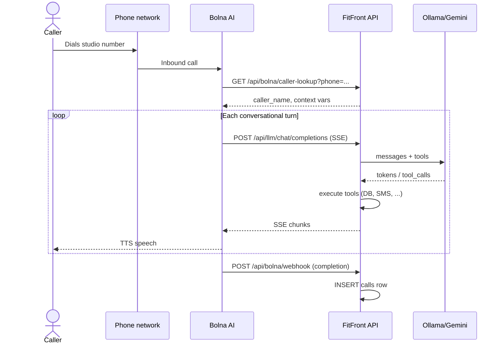

# 06 — Voice & External Integrations

## Bolna voice pipeline

### Analogy

Bolna is the **phone headset + mouth** of the agent. FitFront is the **brain**. Bolna handles PSTN, speech-to-text, text-to-speech; FitFront decides *what to say* via the LLM tool loop.

### Call flow



### Entry points (code)

| Endpoint | Purpose | File:line |
|----------|---------|-----------|
| `GET /api/bolna/caller-lookup` | Pre-call: resolve caller name for Bolna template vars | `bolna.py:155–156` |
| `POST /api/llm/chat/completions` | Custom LLM backend (OpenAI-compatible SSE) | `llm_proxy.py:82–83` |
| `POST /api/bolna/webhook` | Post-call: save transcript, duration, outcome | `bolna.py:205–206` |
| `POST /api/bolna/call` | Manual outbound test call | `bolna.py:82–83` |

### Caller lookup

Bolna hits FitFront before the conversation to substitute `{{caller_name}}` and `{{contact_number}}` into its system prompt template. FitFront extracts these from the first system message in LLM requests (`llm_proxy.py:115–140`).

### Webhook payload (what we know from code)

`bolna_webhook` reads JSON body fields including:

- `execution_id` → stored as `Call.vapi_call_id` (`bolna.py:281–307`)
- `status` → mapped to `CallOutcome` (`bolna.py:250–272`)
- `transcript` → stored in `Call.transcript` JSONB
- `duration` → `duration_seconds`
- Caller phone from body/metadata

Exact full schema: **not documented in repo** — inferred from field access in `bolna.py:205–321`.

### Platform credentials

Bolna API key + agent ID stored in:

- `platform_config` DB table (`platform_admin.py:74+`), or
- env vars `BOLNA_API_KEY`, `BOLNA_AGENT_ID` (`backend/config.py`, `bolna.py:47–76`)

Configured by platform admin, not each studio owner.

### Tenant resolution caveat

```python
# bolna.py:275
tenant_ctx = await resolve_default_tenant()
```

Voice calls attach to the **first ACTIVE tenant**, not the studio matching the dialed number. Same for `llm_proxy.py:102`. Critical for multi-tenant deployments.

---

## Twilio SMS

### Outbound — `sms_service.py`

Triggered by:

- Tool `send_sms` during agent conversations
- Booking/cancellation confirmation helpers
- Waitlist notifications (`waitlist_service.py:605–609`)
- Reminder background loop (`reminder_service.py` via `main.py:210`)
- Dashboard `POST /api/sms/send` (`sms_messages.py:171`)

Uses httpx to Twilio REST API. Credentials from `TenantContext` (per-tenant SID/token/phone) with platform env fallback.

### DEMO_MODE behavior

```python
# backend/services/sms_service.py:107–110, 133–139 (pattern)
# When demo: log-only or skip send; no Twilio HTTP call
```

Resolution order: `tenant_ctx.demo_mode` → global `settings.DEMO_MODE`.

### LOCAL_CHAT_MODE

When `LOCAL_CHAT_MODE=true`, outbound SMS is skipped entirely (`sms_service.py:133–135` per exploration). Chat dev doesn't spam real phones.

### Inbound — `/webhook/sms`

```python
# backend/routes/sms_webhook.py:21–22
@router.post("/webhook/sms")
async def sms_webhook(request: Request):
```

Twilio POSTs `application/x-www-form-urlencoded`: `From`, `To`, `Body`, `MessageSid`.

Routing (`sms_inbound_service.py:5–13`):

1. **Keyword fast-path** — CONFIRM, CANCEL, RESCHEDULE, STOP
2. **Waitlist YES** — if caller has NOTIFIED waitlist entry
3. **Agentic** — everything else → `llm_service.process_message`

Tenant resolved by matching inbound **`To`** against `Tenant.twilio_phone_number` (`sms_inbound_service.py:75–113`) — **proper multi-tenant routing for SMS**.

Response: TwiML XML with reply message.

---

## Google Calendar

### Platform vs per-tenant

| Piece | Scope | Storage |
|-------|-------|---------|
| OAuth app credentials | Platform-wide | `GOOGLE_CLIENT_ID`, `GOOGLE_CLIENT_SECRET` env |
| Refresh token | **Per tenant** | `Tenant.google_calendar_refresh_token` (`tenant.py:105–107`) |
| Connection UI | Studio owner | `AgentConfig` → `/api/integrations/google/*` |

### OAuth flow

```python
# backend/routes/google_oauth.py
GET  /api/integrations/google/connect    → redirect to Google
GET  /api/integrations/google/callback   → exchange code, store refresh token
POST /api/integrations/google/disconnect
GET  /api/integrations/google/status
```

Helpers in `backend/services/google_calendar.py:54–99`.

### When calendar sync happens

- **On book/reschedule/cancel** — `calendar_service` + `gcal.*` when tenant connected
- **Manual sync** — `POST /api/appointments/sync-gcal` (`appointments.py:526`)
- **Dashboard cancel** — optional GCal delete (`appointments.py:226–244`)

Native Postgres scheduling always runs; GCal is additive mirror.

---

## DEMO_MODE & LOCAL_CHAT_MODE

### Why they exist

**Pattern:** *Simulated integrations* let you develop and demo the full UX without paid API keys or public URLs — similar to Spring `@Profile("local")` stub beans.

### Definitions

```python
# backend/config.py:70, 90
DEMO_MODE: bool = os.getenv("DEMO_MODE", "true").lower() == "true"
LOCAL_CHAT_MODE: bool = os.getenv("LOCAL_CHAT_MODE", "false").lower() == "true"
```

`.env.example` sets both `true` for local demo.

### What each flag controls

| Flag | Effect | Key files |
|------|--------|-----------|
| `DEMO_MODE` (global) | Simulated SMS/calendar when no tenant context; logged at startup | `main.py:179–182`, `sms_service.py`, `calendar_service.py` |
| `Tenant.demo_mode` | Per-studio override; wins when `TenantContext` present | `tenant.py:74`, `dashboard.py:448` |
| `LOCAL_CHAT_MODE` | Skip localtunnel; `SERVER_BASE_URL=localhost` | `start.sh:24–35` |
| `LOCAL_CHAT_MODE` | Skip outbound SMS entirely | `sms_service.py:133–135` |

### Health endpoint exposes demo state

```python
# backend/main.py:308–315
return {"status": "healthy", "service": "FitFront", "demo_mode": settings.DEMO_MODE}
```

### Chat availability vs LOCAL_CHAT_MODE

Despite the name, `GET /api/chat/enabled` **always returns true** (`chat.py:76–79`). `LOCAL_CHAT_MODE` affects tunnel/SMS behavior, not whether `/chat` route exists.

---

## Integration checklist (full stack)

From `docs/FULL_STACK_SETUP.md` + code:

1. `DEMO_MODE=false`, `LOCAL_CHAT_MODE=false`
2. `LLM_PROVIDER=gemini` + `GEMINI_API_KEY` (Bolna cannot reach local Ollama)
3. Public `SERVER_BASE_URL` (Railway URL or localtunnel)
4. Twilio webhook → `{SERVER_BASE_URL}/webhook/sms`
5. Bolna custom LLM URL → `{SERVER_BASE_URL}/api/llm/chat/completions`
6. Bolna webhooks → caller-lookup + completion URLs
7. Google OAuth redirect URI registered for your domain
8. Per-tenant: connect GCal, assign Twilio number (admin integrations endpoint)

---

## start.sh role

One-command local backend (`start.sh`):

1. Reads `LOCAL_CHAT_MODE` from `.env`
2. Optionally starts localtunnel and patches `SERVER_BASE_URL`
3. Activates venv, runs uvicorn `--reload`
4. Optionally warms Ollama model

Does **not** start frontend or Postgres — those are separate commands.

Next: [07_glossary_and_learning_resources.md](./07_glossary_and_learning_resources.md)
